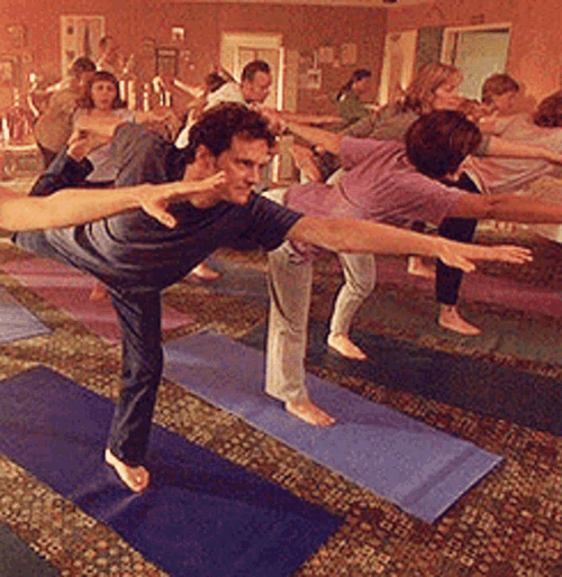

# Multimodal Transformer Fusion of CNN and Keypoint Representations for Yoga Pose Classification

<div align="center">
  
  
  
</div>

This project addresses the yoga posture classification problem by developing an automated system that can identify a pose from a single image. We implement a multimodal pipeline that fuses a **ResNet-18** image-encoded vector with a **YOLOv11-Pose** keypoint vector, feeding them into a lightweight **Multi-Token Transformer**. Our approach, tested on a dataset of 2,800 images across 47 classes, achieves a **+6%** increase in Top-1 accuracy over the best single-modality baseline, demonstrating the effectiveness of feature fusion.




---

## 📋 Table of Contents

1.  [Core Features](#-core-features)
2.  [Methodology](#-methodology)
3.  [Repository Structure](#-repository-structure)
4.  [How to Run the Code](#-how-to-run-the-code)
5.  [Model Hyperparameters](#-model-hyperparameters)
6.  [Final Results](#-final-results)
7.  [Credits and Attribution](#-credits-and-attribution)

---

## ✨ Core Features

* *Multi-Token Transformer Architecture:* A custom Transformer that tokenizes keypoints into 17 individual tokens and processes them alongside a single CNN token and a learnable [CLS] token for robust feature integration.
* *Systematic Optimization:* Utilizes the *Optuna* framework with a TPESampler and MedianPruner for efficient and automated hyperparameter tuning.
* *Comparative Analysis:* Benchmarks the fused Transformer against two single-modality baselines: a fine-tuned ResNet-18 (CNN-only) and a basic MLP (keypoints-only).

---

## 🧠 Methodology

The classification pipeline is designed to leverage the complementary strengths of both visual and geometric data.

1.  *Keypoint Extraction:* A *YOLOv11-Pose* model, pre-trained on the COCO dataset, is used to generate joint coordinates. For each image, it extracts the (x, y) coordinates and a confidence score for 17 keypoints, resulting in a *51-dimensional feature vector* (17 joints × 3 features).

2.  *CNN Feature Extraction:* A *ResNet-18* model, pre-trained on ImageNet, is fine-tuned on the yoga dataset. The final classification layer is then replaced with an identity mapping to extract a *512-dimensional feature vector*.

3.  *Multi-Token Transformer Fusion:*
    * *Tokenization:* The 51-D keypoint vector is split into 17 distinct 3-D tokens (one for each joint). The 512-D CNN vector is treated as a single token.
    * *Projection:* All 18 tokens (17 keypoint + 1 CNN) are projected into a shared latent space of *256 dimensions* using separate linear layers.
    * *CLS Token:* A special, learnable [CLS] token is prepended to the sequence, resulting in a total of 19 tokens. This token acts as a global summary of the entire input.
    * *Encoding:* Positional embeddings are added to the sequence, which is then fed into a *2-layer Transformer Encoder* with 8 attention heads. This allows the model to learn the relationships between all feature tokens.
    * *Classification:* The final output embedding of the [CLS] token is passed through a LayerNorm and a final linear layer to predict one of the 47 yoga pose classes.

 
---
## 📂 Repository Structure

The project is organized with a clear separation between different models and data processing utilities.
```text
.
├── .gitignore
├── README.md
├── datasets/
    ├── combo_features.csv
    ├── resnet18_test_embeddings_half_fine_tune.csv
    ├── yolo_keypoints_confidence_dataset.csv
    └── Transformer's_datasets/
       ├── train_set_half_fine_tune_kp_conf.csv
       ├── val_set_half_fine_tune_kp_conf.csv
       └── test_set_half_fine_tune_kp_conf.csv
├── src/
    ├── ResNet18_classifier/
    │   └── resnet18_fine_tuned_embbeding_extractor.py
    │   └── resnet_fine_tuning_process.py
    │   └── best_fine_tune_resnet18.pth
    ├── Data_processing/
    │   ├── combined_csv_creator.py
    │   ├── make_counter_classes.py
    │   ├── train_val_test_divide.py
    ├── Pose_keypoints_labeling/
    │   ├── YogaClassifier.py
    │   └── yolo_pose_confidence_labeler.py
    ├── MLP_classifier/
    │   ├── evaluate_MLP_classifier.py
    │   └── MLP_classifier_training.py  
    └── Transformer/
        ├── MultiTokenTransformer.py
        ├── transformer_train_loop.py
        ├── optimize_multi_token_transformer.py
        └── evaluate_best_multi_token_trans.py
└── Results/
        ├── best_weights_multi_token.pth
        ├── multi-token-transformer-hpo.db
        ├── best_hyperparameters_multi_token.json
        ├── best_trial_history_multi_token.json
        └── model_summary.txt
```
---

## 🚀 How to Run the Code

The workflow is divided into optional feature extraction, data preparation, optimization, and training.

1. *(Optional) Feature Extraction – CNN embeddings*
   - *Fine-tune ResNet-18* on your yoga images and save the weights.
   - *Export embeddings CSV* for all images using the fine-tuned model (512-dim vectors per image).
   - Expected output: resnet18_embeddings.csv (one row per image, includes an image_path/label column and a 512-D feature vector).
   - Scripts: resnet18_fine_tuned_embbeding_extractor.py, resnet18_embedding_extractor.py  
     (Adjust paths/args inside the scripts as needed.)

2. *(Optional) Feature Extraction – Keypoints*
   - *Run the YOLO pose labeler* to detect 17 keypoints per image and export a CSV.
   - Expected output: yolo_keypoints_dataset.csv (per image: 17×(x, y, conf) → 51 features + identifiers/labels).
   - Tool/Script: YOLOv11 Pose + your label/export script.

3. *Data Preparation*
   - Use the scripts in src/Data_Processing/ to:
     - merge features (e.g., keypoints + CNN embeddings),
     - create stratified train/val/test splits,
     - and write the cleaned CSVs.
   - Typical outputs: train_set.csv, val_set.csv, test_set.csv (and any intermediate merged files like combo_features.csv).

4. *Hyperparameter Optimization (Optional)*
   - Run the Optuna scripts (optimize_*.py) in the Transformer directory to search for the best hyperparameters.

5. *Train the Final Model*
   - Run src/Transformer/train_best_transformer.py to train using the selected hyperparameters.
---

## ⚙ Model Hyperparameters

### 1) Multi-Token Transformer (Our Model)

| Optimizer | Learning Rate | Epochs | Batch Size | Heads | Layers | Embedding Dim | Dropout |
|:---------:|:-------------:|:------:|:----------:|:-----:|:------:|:-------------:|:-------:|
| AdamW     | 2.45e-4       | 15     | 64         | 8     | 2      | 256           | 0.25    |

### 2) ResNet-18 (CNN-Only Baseline)

| Optimizer | Learning Rate | Epochs | Batch Size | Trainable Params* |
|:---------:|:-------------:|:------:|:----------:|:-----------------:|
| Adam      | 5e-4          | 25     | 32         | 24,111 (≈0.22%)   |

\* Training last FC layer only (≈24k of ~11.7M total).

### 3) MLP (Keypoints-Only Baseline)

| Optimizer | Learning Rate | Epochs | Batch Size | Num of Params |
|:---------:|:-------------:|:------:|:----------:|:-------------:|
| Adam      | 1e-3          | 30     | 32         | 10,543        |

---

## 📊 Final Results

| Model                          | Test Accuracy | Test F1 (Macro) | Test mAP |
|:-------------------------------|:-------------:|:---------------:|:--------:|
| MLP (Keypoints-Only)           | 66.80%        | 0.668           | 0.707    |
| ResNet-18 (CNN-Only)           | 64.80%        | 0.648           | 0.681    |
| *Multi-Token Transformer*    | *73.05%*    | *0.758*       | *0.789* |


The analysis showed that classes with very few training images (e.g., classes 2, 6, 8, 23) performed poorly across all models. Additionally, some visually similar poses, like Class 27 (Pincha Mayurasana) and Class 1 (Adho Mukha Vrksasana), were frequently confused.

---

## 📜 Credits and Attribution

This project builds upon the foundational work of many researchers and the open-source community.

* **Frameworks:** PyTorch, Optuna
* **Models & Architectures:** YOLOv11-Pose, ResNet ("Deep Residual Learning for Image Recognition"), Transformers ("Attention Is All You Need")
* **Dataset:** Kaggle Yoga Posture Dataset
* **Inspiration:** Yoga-82 Dataset Paper ("Yoga-82: A New Dataset for Fine-grained Classification of Human Poses")
